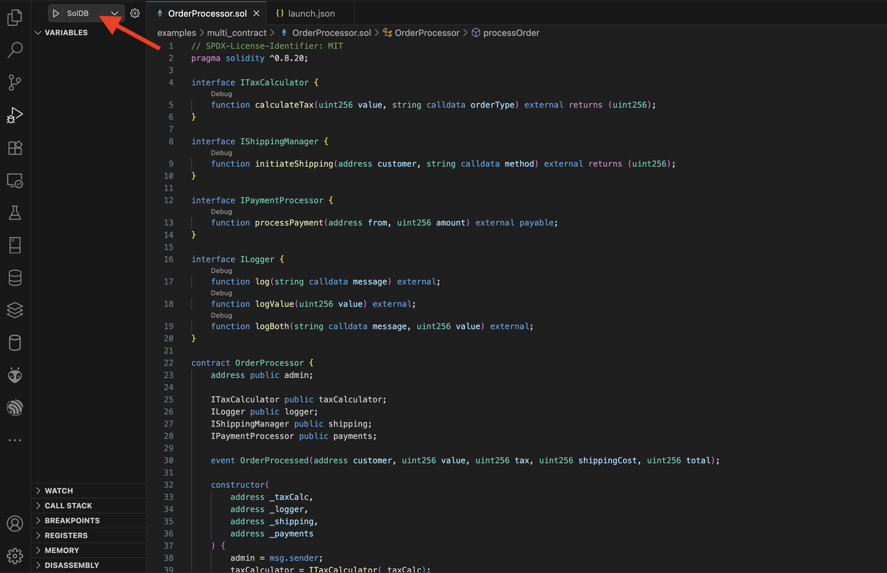
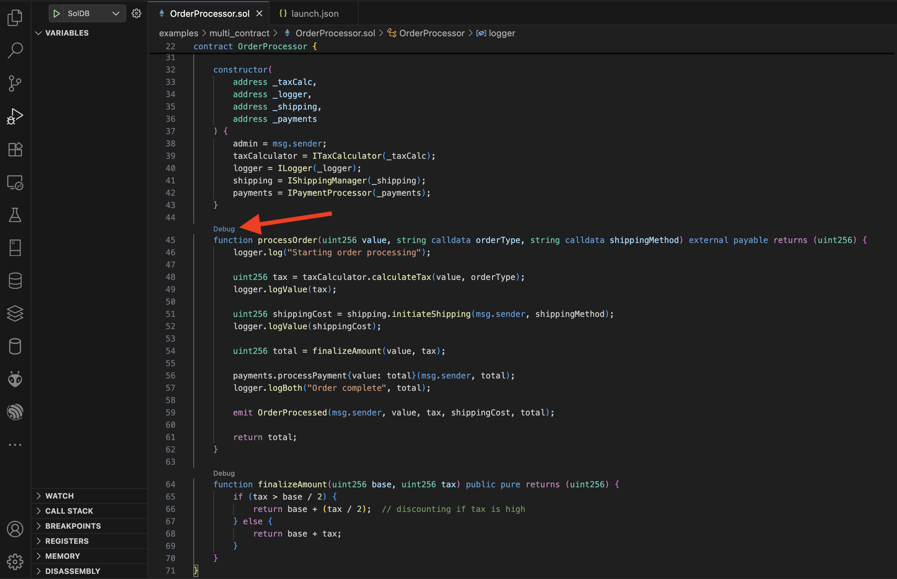

# vscode-soldb
VSCode Extension for Debugging Solidity

## Usage Guide

Create `launch.json` file with attributes shown below.
```json
{
    "version": "0.2.0",
    "configurations": [

        {
            "name": "SolDB",
            "type": "soldb",
            "request": "launch",
            "dapServerPath": "", // Path to DAP server script
            "soldbPath": "", // Path to soldb root directory
            "function": "processOrder(uint256,string,string)",
            "functionArgs": ["100", "physical", "express"],
            "contracts": "", // Path to contracts.json file
            "ethdebugDir": "", // Path to ethdebug directory
            "from_addr": "0x99bbA657f2BbC93c02D617f8bA121cB8Fc104Acf",
        }
    ]
}
```

> **Note:** For single contract debugging set `ethdebugDir` path
> **Note:** For multi contract debbuging set `contracts` path in format shown below.

* `contracts.json` format:
```json
{
  "contracts": [
    {
      "address": "<contract_1 address>",
      "name": "<contract_1 name>",
      "debug_dir": "<path to contract_1's ethdebug directory>"
    },
    {
      "address": "<contract_2 address>",
      "name": "<contract_2 name>",
      "debug_dir": "<path to contract_2's ethdebug directory>"
    },
  ]
}
```

## Option 1:
Debugging with function's signature and arguments set in `launch.json`


## Option 2:
Debugging with `Debug` button above the function name


